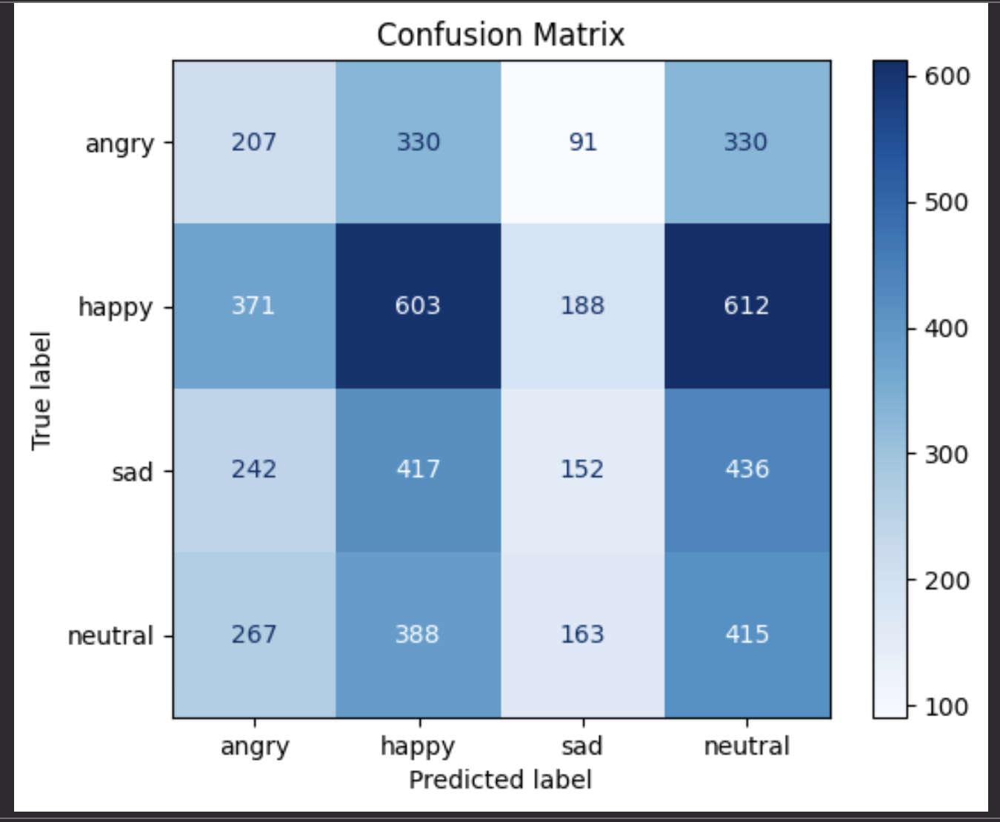

🎭 Emotion Detection using Deep Learning

A deep learning-based project that classifies human facial expressions into emotions using a Convolutional Neural Network (CNN).

⸻

🚀 Features
• Detects 4 emotions:
• 😐 Neutral
• 😊 Happy
• 😢 Sad
• 😠 Angry
• Trained deep learning model using TensorFlow/Keras
• Simple Python-based interface
• Extendable to real-time emotion detection

⸻

🧠 Model Performance
• Test Accuracy: 66.14%
• Loss: 0.8073

Note: Emotion detection is a challenging task due to subtle facial variations and dataset limitations.

⸻

📊 Evaluation

🔹 Confusion Matrix

This helps visualize:
• Which emotions are correctly predicted
• Where the model gets confused (e.g., Sad vs Neutral)

⸻

🧠 Tech Stack
• Python
• TensorFlow / Keras
• OpenCV
• NumPy, Matplotlib
• FastApi
